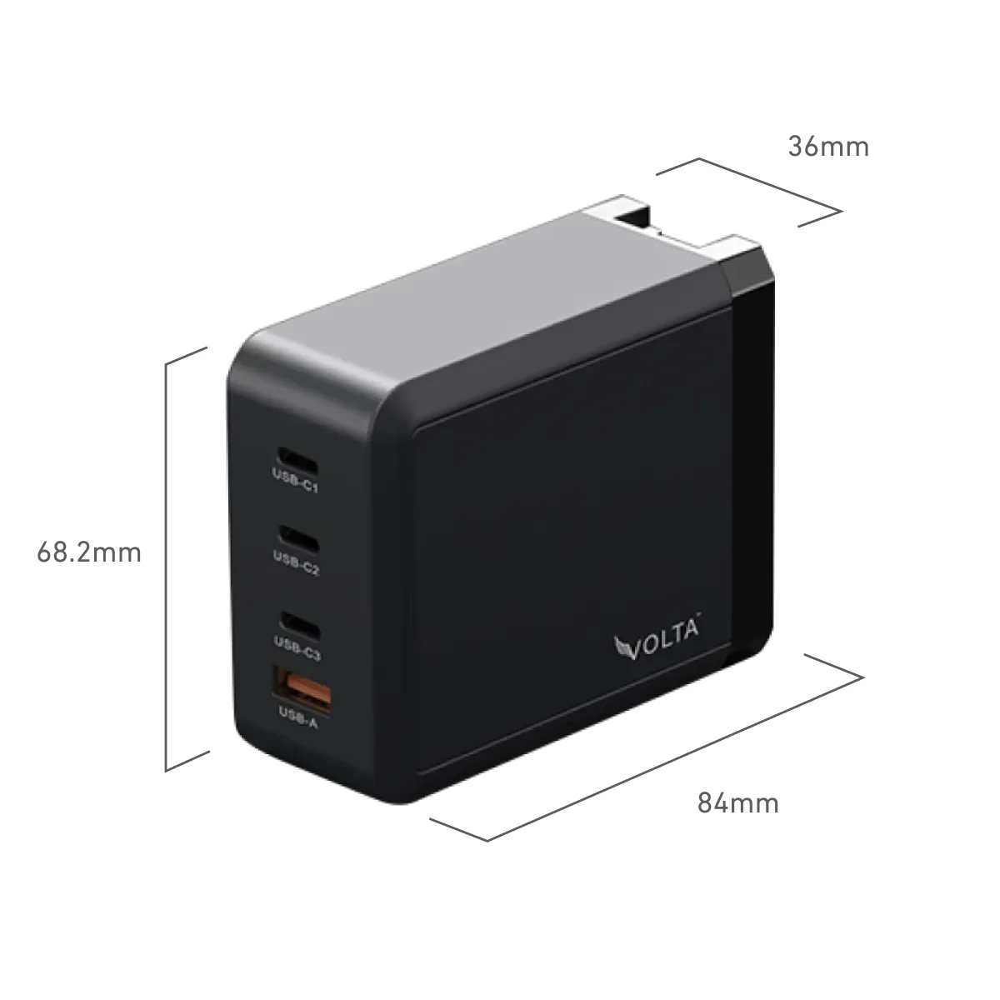
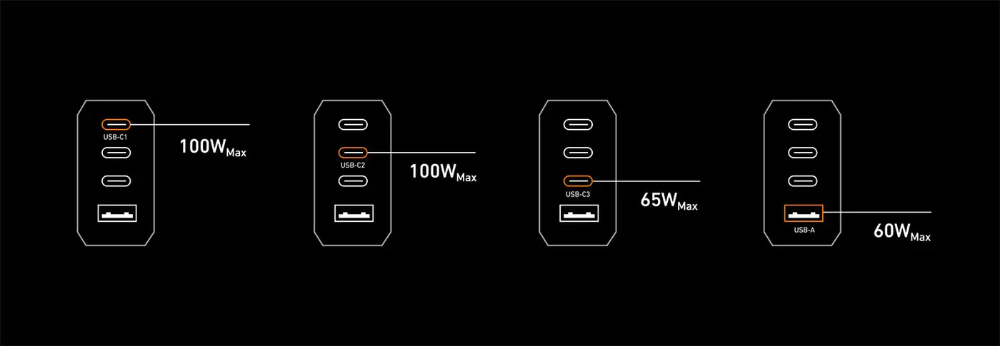

- Purchase URLs:
  - [Volta site](https://www.voltacharger.com/products/giga-200w-gan-charger)
  - [Amazon](https://www.amazon.com/Charger-4-Port-Compact-Charging-MacBook/dp/B0CG53JVSY/ref=sr_1_1?dib=eyJ2IjoiMSJ9.83mPM3Ehn5JX-abO93vqFQ.JFhViBNebDVTY8oImtuHJJaGDY_XSnJS35_rSq5AR2Y&dib_tag=se&keywords=volta+GIGA+200W+GaN&qid=1704957011&sr=8-1&ufe=app_do%3Aamzn1.fos.006c50ae-5d4c-4777-9bc0-4513d670b6bc)
- Price: ≈$100
- Similar items from:
  - ["OTAO"](https://www.amazon.com/Charger-OTAO-Charging-Station-iPhone14/dp/B0B65G3DC4)
  - ["WOTOBEUS"](https://www.amazon.com/Charger-Station-WOTOBEUS-Charging-Adapter/dp/B09YL7G9LP)
- White label: probably?

## Images

## Specs

- 4 ports (3 USB-C + 1 USB-A)
- 6.82cm × 8.4cm × 3.6cm
- 310g

### Power per port:

| USB-C #1 | USB-C #2 | USB-C #3 | USB-A |
|-|-|-|-|
| 100W | 100W | 65W | 25W |
Tested so far: 100W from USB-C #1.

USB-C #2 reduces to 65W when total wattage would otherwise exceed 200W. Details from the product page:

USB-C1 + USB-C2: 100W + 100W (200W MAX)
USB-C1 + USB-C3: 100W + 65W (165W MAX)
USB-C2 + USB-C3: 100W + 65W (165W MAX)

USB-C1 + USB-A: 100W + 65W (165W MAX)
USB-C2 + USB-A: 100W + 65W (165W MAX)
USB-C3 + USB-A: 25W (share) (5V/3A+2A (25W MAX))
USB-C1+ USB-C2 + USB-C3: 100W + 65W + 30

USB-C1 + USB-C2 + USB-A: 100W + 65W + 30W
USB-C1 + USB-C3 + USB-A: 100W + 15W(5V/3A)
USB-C2 + USB-C3 + USB-A: 100W + 25W (share) (5V/3A+2A (25W MAX))

USB-C1+ USB-C2 + USB-C3 + USB-A: 100W + 65W + 25W (share) (5V/3A+2A (25W MAX))

## Conveniences

- Plugs directly into a wall outlet / power strip (i.e. no need to pack with an extra cable).
- Comes with well-fitting adapters for UK/EU/AU.
