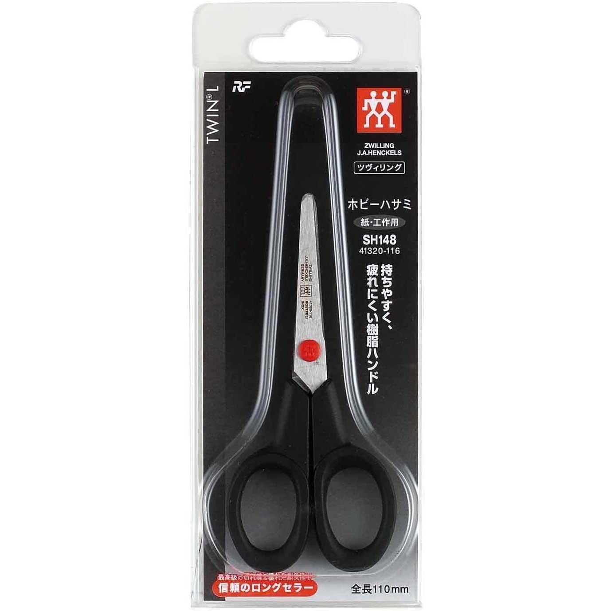
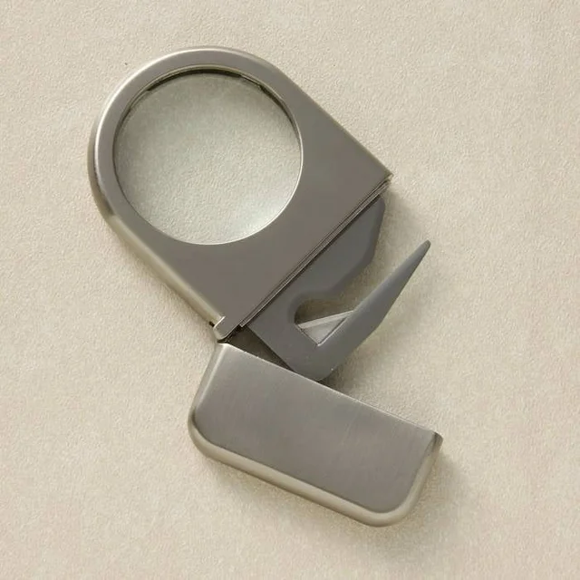
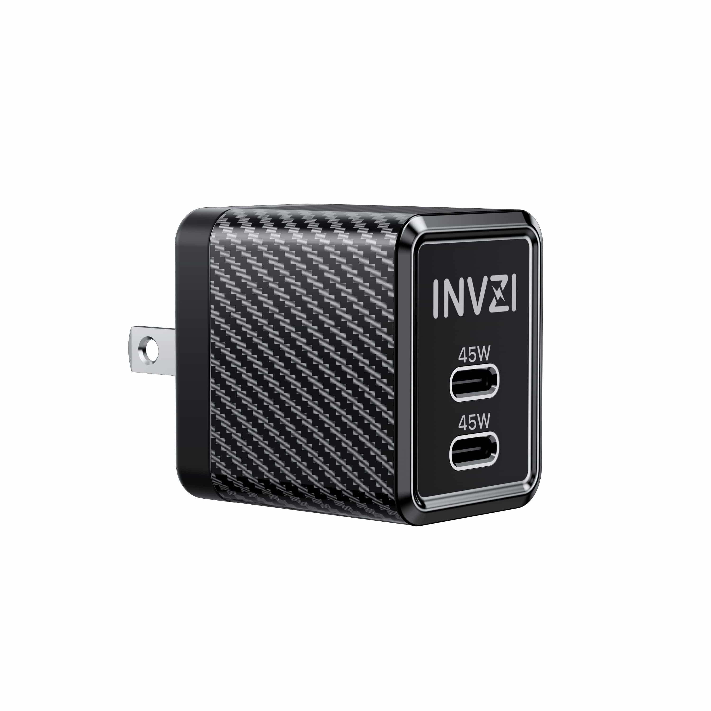
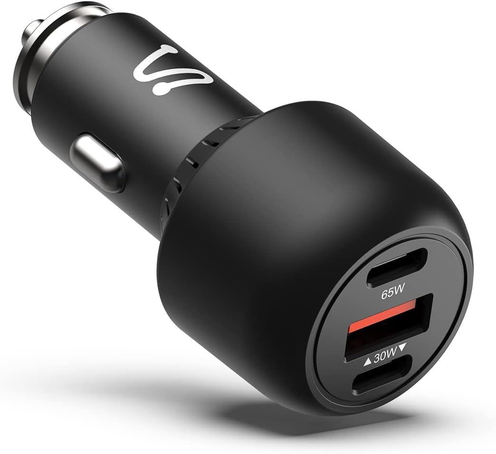
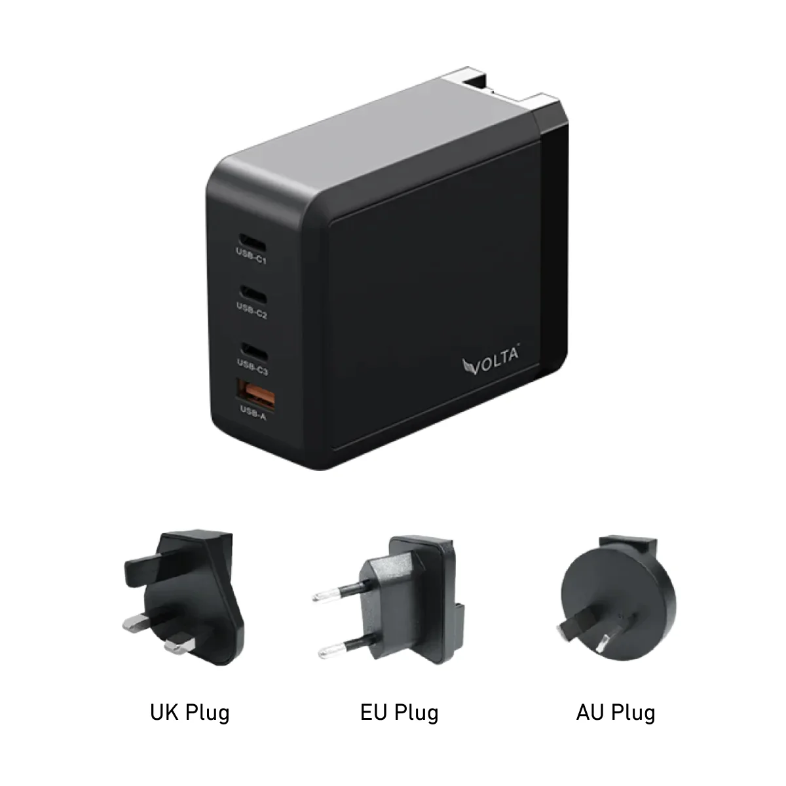
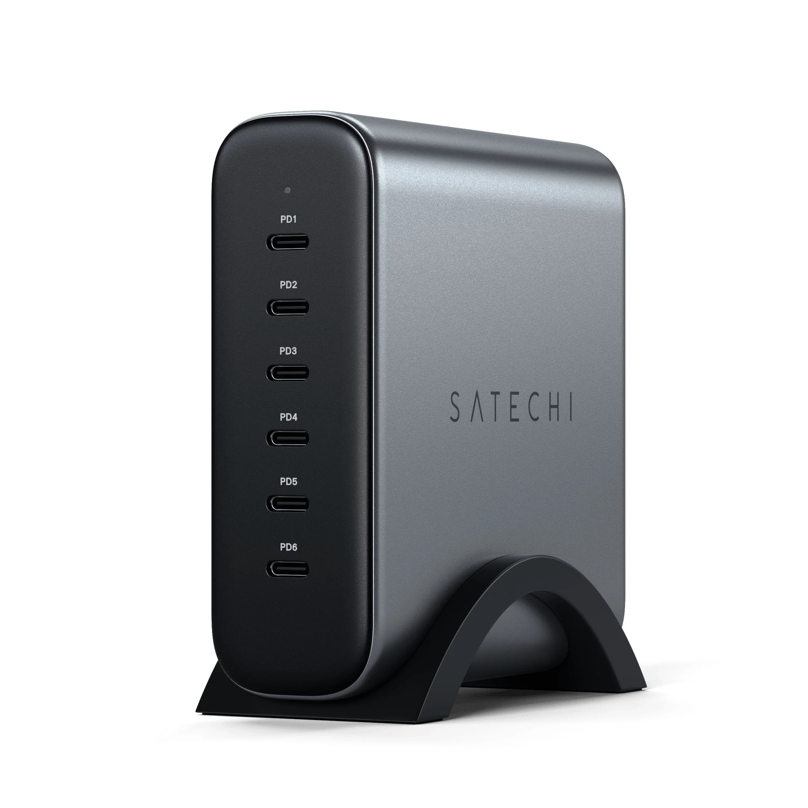
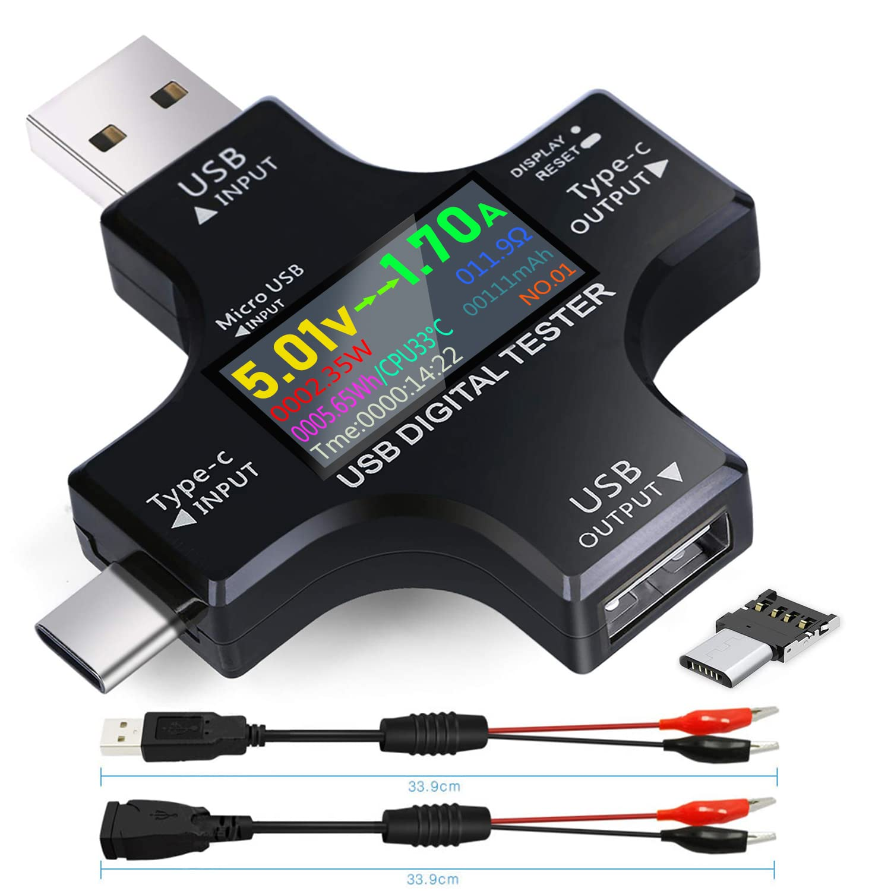
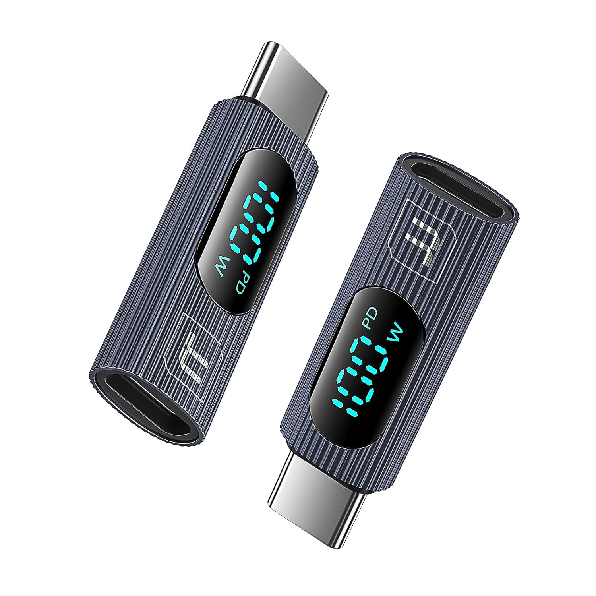

# Lucas's electronics hardware & more

How to be ready any time someone asks "does someone have an adapter with them?":

Unpacked:

## Priorities

Each item optimizes the following priorities, in order of importance:

- Physical size/portability
- Specs (e.g. speed, power, storage size)
- Elegance
- Value (performance for the price)

In addition, USB-A and Lightning are legacy connectors and should be avoided if at all possible. When referring to an adapter, USB-C is assumed by default.

## Audio
| Item | Image |
| ---- | ---- |
| [USB-C audio adapter with PD](Audio%20&%20Video/USB-C%20audio%20adapter%20with%20PD.md) $8 |  |
| [HDMI adapter (by nonda)](Audio%20&%20Video/HDMI%20adapter%20(by%20nonda).md) ≈$22  |  |
| [USB-C audio + mic adapter](Audio%20&%20Video/USB-C%20audio%20+%20mic%20adapter.md) $10 |  |

## Data storage and reading
| Item | Image |
| ---- | ---- |
| [Tiny Micro SD dual reader (USB-C + USB-A)](Data%20storage%20and%20reading/Tiny%20Micro%20SD%20dual%20reader%20(USB-C%20+%20USB-A).md) ≈$1 |  |

## Desk
| Item | Image |
| ---- | ---- |
| [Small scissors (by Zwilling Henckels)](Desk/Small%20scissors%20(by%20Zwilling%20Henckels).md) ≈$24 |  |
| [Letter opener with magnifying glass (by Bey-Berk)](Desk/Letter%20opener%20with%20magnifying%20glass%20(by%20Bey-Berk).md) ≈$30 |  |
## Legacy adapters
| Item | Image |
| ---- | ---- |
| [Lightning data (OTG) adapter](Legacy%20adapters/Lightning%20data%20(OTG)%20adapter.md) ≈$12 |  |
| [Lightning power adapter](Legacy%20adapters/Lightning%20power%20adapter.md) ≈$19 for 2 |  |

## Power
| Item | Image |
| ---- | ---- |
| [45W wall charger (2×USB-C)](Power/45W%20wall%20charger%20(2×USB-C).md) ≈$40 |  |
| [95W car charger (2×USB-C + 1×USB-A)](Power/95W%20car%20charger%20(2×USB-C%20+%201×USB-A).md) ≈$22 |  |
| [200W wall charger (3×USB-C + 1×USB-A)](Power/200W%20wall%20charger%20(3×USB-C%20+%201×USB-A).md) ≈$100 |  |
| [200W wall charger (6×USB-C, by Satechi)](Power/200W%20wall%20charger%20(6×USB-C,%20by%20Satechi).md) ≈$130 |  |
| [USB-C + USB-A multimeter](Power/USB-C%20+%20USB-A%20multimeter.md) ≈$11 |  |
| [Small USB-C multimeter](Power/Small%20USB-C%20multimeter.md) $4 |  |
## USB-C and Thunderbolt
| Item | Image |
| ---- | ---- |
| [Tiny Thunderbolt extender](USB-C%20and%20Thunderbolt/Tiny%20Thunderbolt%20extender.md) $7 for 2 |  |
| [MacBook-spaced dual Thunderbolt extender](USB-C%20and%20Thunderbolt/MacBook-spaced%20dual%20Thunderbolt%20extender.md) ≈$9 |  |